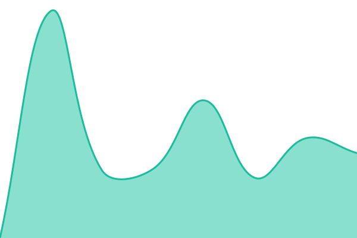
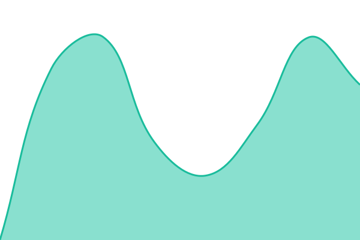
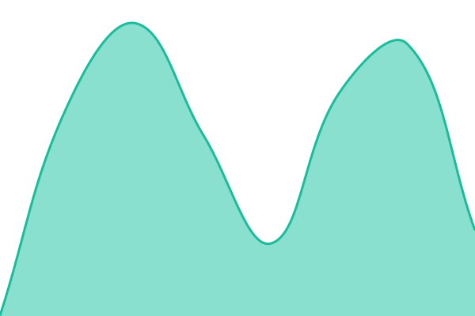
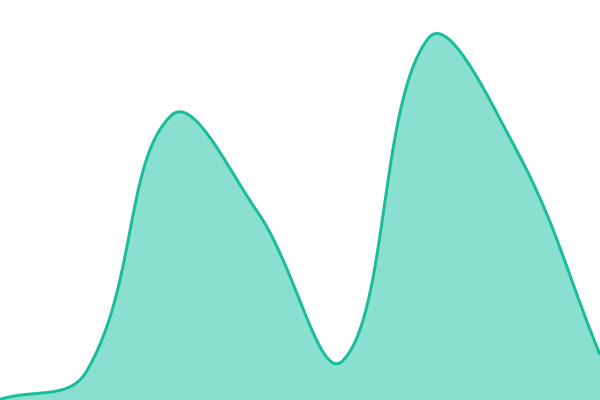
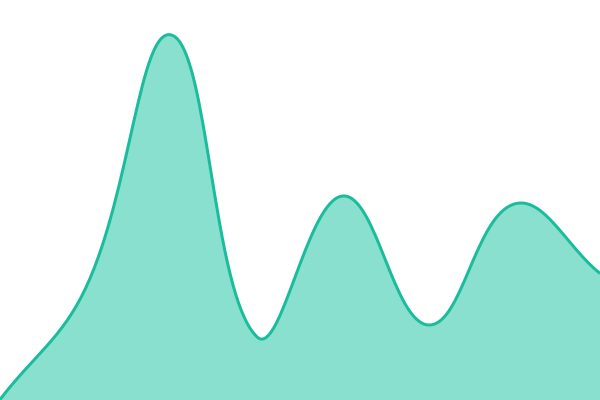
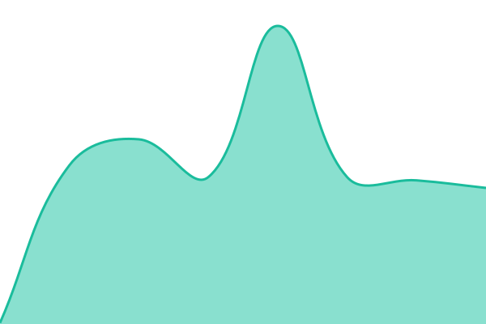
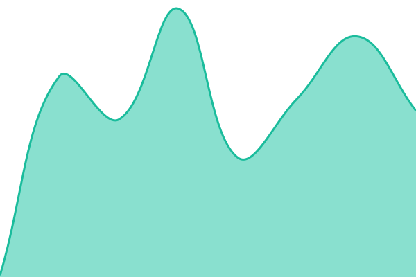
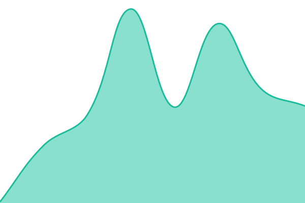
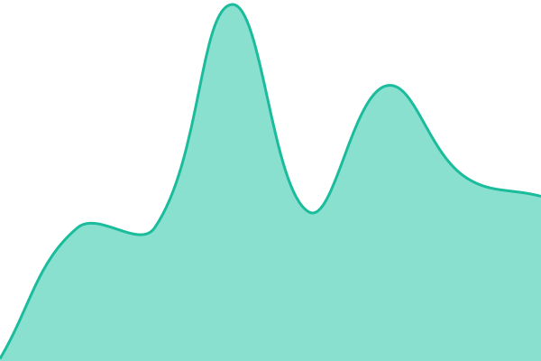

# [📈 Live Status](https://danielqb.github.io/status): <!--live status--> **🟧 Partial outage**

This repository contains the open-source uptime monitor and status page for [QB](pihlab.net), powered by [Upptime](https://github.com/upptime/upptime).

With [Upptime](https://upptime.js.org), you can get your own unlimited and free uptime monitor and status page, powered entirely by a GitHub repository. We use [Issues](https://github.com/danielqb/status/issues) as incident reports, [Actions](https://github.com/danielqb/status/actions) as uptime monitors, and [Pages](https://danielqb.github.io/status) for the status page.

<!--start: status pages-->
<!-- This summary is generated by Upptime (https://github.com/upptime/upptime) -->
<!-- Do not edit this manually, your changes will be overwritten -->
<!-- prettier-ignore -->
| URL | Status | History | Response Time | Uptime |
| --- | ------ | ------- | ------------- | ------ |
|  [DIAN - Portal](https://www.dian.gov.co/) | Arriba | [dian-portal.yml](https://github.com/danielqb/status/commits/HEAD/history/dian-portal.yml) | 

 701milisegundo
     
 | 

<a href="https://danielqb.github.io/status/history/dian-portal">100.00%</a>
    

|  [DIAN - Muisca](https://muisca.dian.gov.co/) | Arriba | [dian-muisca.yml](https://github.com/danielqb/status/commits/HEAD/history/dian-muisca.yml) | 

 443milisegundo
     
 | 

<a href="https://danielqb.github.io/status/history/dian-muisca">96.19%</a>
    

|  [DIAN - Agendamiento de Citas](https://www.dian.gov.co/atencionciudadano/Agendamiento-de-Citas/Paginas/Inicio.aspx) | Arriba | [dian-agendamiento-de-citas.yml](https://github.com/danielqb/status/commits/HEAD/history/dian-agendamiento-de-citas.yml) | 

 956milisegundo
     
 | 

<a href="https://danielqb.github.io/status/history/dian-agendamiento-de-citas">100.00%</a>
    

|  [DIAN - Compilación Jurídica](https://normograma.dian.gov.co/dian/) | Arriba | [dian-compilacion-juridica.yml](https://github.com/danielqb/status/commits/HEAD/history/dian-compilacion-juridica.yml) | 

 394milisegundo
     
 | 

<a href="https://danielqb.github.io/status/history/dian-compilacion-juridica">100.00%</a>
    

|  [Bancolombia - Portal](https://www.bancolombia.com/) | Arriba | [bancolombia-portal.yml](https://github.com/danielqb/status/commits/HEAD/history/bancolombia-portal.yml) | 

 598milisegundo
     
 | 

<a href="https://danielqb.github.io/status/history/bancolombia-portal">95.47%</a>
    

|  [Bancolombia - Personas](https://sucursalpersonas.transaccionesbancolombia.com/) | Arriba | [bancolombia-personas.yml](https://github.com/danielqb/status/commits/HEAD/history/bancolombia-personas.yml) | 

 227milisegundo
     
 | 

<a href="https://danielqb.github.io/status/history/bancolombia-personas">100.00%</a>
    

|  [Bancolombia - Empresas](https://sucursalempresas.transaccionesbancolombia.com/) | Arriba | [bancolombia-empresas.yml](https://github.com/danielqb/status/commits/HEAD/history/bancolombia-empresas.yml) | 

 213milisegundo
     
 | 

<a href="https://danielqb.github.io/status/history/bancolombia-empresas">100.00%</a>
    

|  [CCB - Portal](https://www.ccb.org.co/) | Abajo | [ccb-portal.yml](https://github.com/danielqb/status/commits/HEAD/history/ccb-portal.yml) | 

 35milisegundo
     
 | 

<a href="https://danielqb.github.io/status/history/ccb-portal">0.00%</a>
    

|  [CCB - Transacciones](https://linea.ccb.org.co/apprenovaciones/index.html#!/) | Arriba | [ccb-transacciones.yml](https://github.com/danielqb/status/commits/HEAD/history/ccb-transacciones.yml) | 

 216milisegundo
     
 | 

<a href="https://danielqb.github.io/status/history/ccb-transacciones">100.00%</a>
    

|  [Certicamara - Portal](https://certicamara.com/) | Arriba | [certicamara-portal.yml](https://github.com/danielqb/status/commits/HEAD/history/certicamara-portal.yml) | 

 484milisegundo
     
 | 

<a href="https://danielqb.github.io/status/history/certicamara-portal">100.00%</a>
    

|  [GovCo - ColombiaCompra](https://www.colombiacompra.gov.co/) | Arriba | [gov-co-colombia-compra.yml](https://github.com/danielqb/status/commits/HEAD/history/gov-co-colombia-compra.yml) | 

 867milisegundo
     
 | 

<a href="https://danielqb.github.io/status/history/gov-co-colombia-compra">100.00%</a>
    

|  [GovCo - Portal](https://www.gov.co/) | Arriba | [gov-co-portal.yml](https://github.com/danielqb/status/commits/HEAD/history/gov-co-portal.yml) | 

 79milisegundo
     
 | 

<a href="https://danielqb.github.io/status/history/gov-co-portal">100.00%</a>
    

|  [Minciencia - Portal](https://minciencias.gov.co/) | Arriba | [minciencia-portal.yml](https://github.com/danielqb/status/commits/HEAD/history/minciencia-portal.yml) | 

 730milisegundo
     
 | 

<a href="https://danielqb.github.io/status/history/minciencia-portal">98.47%</a>
    

|  [PSE - Portal](https://www.pse.com.co/persona) | Arriba | [pse-portal.yml](https://github.com/danielqb/status/commits/HEAD/history/pse-portal.yml) | 

 552milisegundo
     
 | 

<a href="https://danielqb.github.io/status/history/pse-portal">100.00%</a>
    

|  [PSE - Pagos](https://portal.psepagos.com.co/inicio) | Arriba | [pse-pagos.yml](https://github.com/danielqb/status/commits/HEAD/history/pse-pagos.yml) | 

 540milisegundo
     
 | 

<a href="https://danielqb.github.io/status/history/pse-pagos">100.00%</a>
    

|  [Aportes en Línea (PILA)](https://www.aportesenlinea.com/) | Arriba | [aportes-en-linea-pila.yml](https://github.com/danielqb/status/commits/HEAD/history/aportes-en-linea-pila.yml) | 

 304milisegundo
     
 | 

<a href="https://danielqb.github.io/status/history/aportes-en-linea-pila">100.00%</a>
    

|  [UGPP](https://www.ugpp.gov.co/) | Arriba | [ugpp.yml](https://github.com/danielqb/status/commits/HEAD/history/ugpp.yml) | 

 163milisegundo
     
 | 

<a href="https://danielqb.github.io/status/history/ugpp">100.00%</a>
    

|  [ADRES](https://www.adres.gov.co/) | Arriba | [adres.yml](https://github.com/danielqb/status/commits/HEAD/history/adres.yml) | 

 257milisegundo
     
 | 

<a href="https://danielqb.github.io/status/history/adres">100.00%</a>
    

|  [Colpensiones](https://www.colpensiones.gov.co/) | Arriba | [colpensiones.yml](https://github.com/danielqb/status/commits/HEAD/history/colpensiones.yml) | 

 3083milisegundo
     
 | 

<a href="https://danielqb.github.io/status/history/colpensiones">100.00%</a>
    

|  [Ministerio de Trabajo](https://www.mintrabajo.gov.co/) | Arriba | [ministerio-de-trabajo.yml](https://github.com/danielqb/status/commits/HEAD/history/ministerio-de-trabajo.yml) | 

 302milisegundo
     
 | 

<a href="https://danielqb.github.io/status/history/ministerio-de-trabajo">100.00%</a>
    

|  [Superintendencia Financiera](https://www.superfinanciera.gov.co/) | Arriba | [superintendencia-financiera.yml](https://github.com/danielqb/status/commits/HEAD/history/superintendencia-financiera.yml) | 

 731milisegundo
     
 | 

<a href="https://danielqb.github.io/status/history/superintendencia-financiera">96.74%</a>
    

|  [Superintendencia de Sociedades](https://www.supersociedades.gov.co/) | Abajo | [superintendencia-de-sociedades.yml](https://github.com/danielqb/status/commits/HEAD/history/superintendencia-de-sociedades.yml) | 

 2173milisegundo
     
 | 

<a href="https://danielqb.github.io/status/history/superintendencia-de-sociedades">84.28%</a>
    

|  [RUES - Registro Único Empresarial](https://www.rues.org.co/) | Arriba | [rues-registro-unico-empresarial.yml](https://github.com/danielqb/status/commits/HEAD/history/rues-registro-unico-empresarial.yml) | 

 77milisegundo
     
 | 

<a href="https://danielqb.github.io/status/history/rues-registro-unico-empresarial">100.00%</a>
    

|  [RUNT](https://www.runt.com.co/) | Abajo | [runt.yml](https://github.com/danielqb/status/commits/HEAD/history/runt.yml) | 

 635milisegundo
     
 | 

<a href="https://danielqb.github.io/status/history/runt">0.00%</a>
    

|  [SIMIT](https://www.simit.org.co/) | Arriba | [simit.yml](https://github.com/danielqb/status/commits/HEAD/history/simit.yml) | 

 497milisegundo
     
 | 

<a href="https://danielqb.github.io/status/history/simit">100.00%</a>
    

|  [Banco de la República](https://www.banrep.gov.co/) | Arriba | [banco-de-la-republica.yml](https://github.com/danielqb/status/commits/HEAD/history/banco-de-la-republica.yml) | 

 854milisegundo
     
 | 

<a href="https://danielqb.github.io/status/history/banco-de-la-republica">100.00%</a>
    

|  [Davivienda](https://www.davivienda.com/) | Arriba | [davivienda.yml](https://github.com/danielqb/status/commits/HEAD/history/davivienda.yml) | 

 124milisegundo
     
 | 

<a href="https://danielqb.github.io/status/history/davivienda">100.00%</a>
    

|  [BBVA Colombia](https://www.bbva.com.co/) | Arriba | [bbva-colombia.yml](https://github.com/danielqb/status/commits/HEAD/history/bbva-colombia.yml) | 

 265milisegundo
     
 | 

<a href="https://danielqb.github.io/status/history/bbva-colombia">100.00%</a>
    

|  [Banco de Bogotá](https://www.bancodebogota.com/) | Arriba | [banco-de-bogota.yml](https://github.com/danielqb/status/commits/HEAD/history/banco-de-bogota.yml) | 

 351milisegundo
     
 | 

<a href="https://danielqb.github.io/status/history/banco-de-bogota">100.00%</a>
    

|  [Banco Popular](https://www.bancopopular.com.co/) | Arriba | [banco-popular.yml](https://github.com/danielqb/status/commits/HEAD/history/banco-popular.yml) | 

 2054milisegundo
     
 | 

<a href="https://danielqb.github.io/status/history/banco-popular">100.00%</a>
    

|  [Nequi](https://www.nequi.com.co/) | Arriba | [nequi.yml](https://github.com/danielqb/status/commits/HEAD/history/nequi.yml) | 

 139milisegundo
     
 | 

<a href="https://danielqb.github.io/status/history/nequi">100.00%</a>
    

|  [Daviplata](https://www.daviplata.com/) | Arriba | [daviplata.yml](https://github.com/danielqb/status/commits/HEAD/history/daviplata.yml) | 

 110milisegundo
     
 | 

<a href="https://danielqb.github.io/status/history/daviplata">100.00%</a>
    

|  [DataCrédito](https://www.datacredito.com.co/) | Arriba | [data-credito.yml](https://github.com/danielqb/status/commits/HEAD/history/data-credito.yml) | 

 161milisegundo
     
 | 

<a href="https://danielqb.github.io/status/history/data-credito">100.00%</a>
    

|  [Claro Colombia](https://www.claro.com.co/) | Arriba | [claro-colombia.yml](https://github.com/danielqb/status/commits/HEAD/history/claro-colombia.yml) | 

 618milisegundo
     
 | 

<a href="https://danielqb.github.io/status/history/claro-colombia">100.00%</a>
    

|  [ETB](https://www.etb.com/) | Arriba | [etb.yml](https://github.com/danielqb/status/commits/HEAD/history/etb.yml) | 

 1539milisegundo
     
 | 

<a href="https://danielqb.github.io/status/history/etb">100.00%</a>
    

|  [Las2orillas](https://www.las2orillas.co/) | Arriba | [las2orillas.yml](https://github.com/danielqb/status/commits/HEAD/history/las2orillas.yml) | 

 105milisegundo
     
 | 

<a href="https://danielqb.github.io/status/history/las2orillas">100.00%</a>
    

|  [Mercadolibre](https://www.mercadolibre.com.co/) | Arriba | [mercadolibre.yml](https://github.com/danielqb/status/commits/HEAD/history/mercadolibre.yml) | 

 477milisegundo
     
 | 

<a href="https://danielqb.github.io/status/history/mercadolibre">100.00%</a>
    

|  [Wplay](https://www.wplay.co/) | Arriba | [wplay.yml](https://github.com/danielqb/status/commits/HEAD/history/wplay.yml) | 

 88milisegundo
     
 | 

<a href="https://danielqb.github.io/status/history/wplay">100.00%</a>
    

|  [Google DNS 1](8.8.4.4) | Arriba | [google-dns-1.yml](https://github.com/danielqb/status/commits/HEAD/history/google-dns-1.yml) | 

 6milisegundo
     
 | 

<a href="https://danielqb.github.io/status/history/google-dns-1">100.00%</a>
    

|  [Google DNS 2](8.8.8.8) | Arriba | [google-dns-2.yml](https://github.com/danielqb/status/commits/HEAD/history/google-dns-2.yml) | 

 6milisegundo
     
 | 

<a href="https://danielqb.github.io/status/history/google-dns-2">100.00%</a>
    

<!--end: status pages-->

[**Visit our status website →**](https://danielqb.github.io/status)

## 📄 License

- Powered by: [Upptime](https://github.com/upptime/upptime)
- Code: [MIT](./LICENSE) © [QB](pihlab.net)
- Data in the `./history` directory: [Open Database License](https://opendatacommons.org/licenses/odbl/1-0/)
