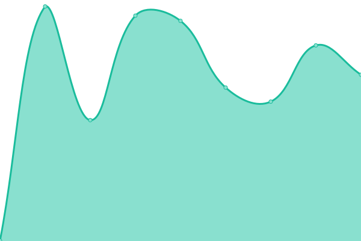

# [📈 Live Status](https://danielqb.github.io/status): <!--live status--> **🟧 Partial outage**

This repository contains the open-source uptime monitor and status page for [QB](pihlab.net), powered by [Upptime](https://github.com/upptime/upptime).

With [Upptime](https://upptime.js.org), you can get your own unlimited and free uptime monitor and status page, powered entirely by a GitHub repository. We use [Issues](https://github.com/danielqb/status/issues) as incident reports, [Actions](https://github.com/danielqb/status/actions) as uptime monitors, and [Pages](https://danielqb.github.io/status) for the status page.

<!--start: status pages-->
<!-- This summary is generated by Upptime (https://github.com/upptime/upptime) -->
<!-- Do not edit this manually, your changes will be overwritten -->
<!-- prettier-ignore -->
| URL | Status | History | Response Time | Uptime |
| --- | ------ | ------- | ------------- | ------ |
|  [DIAN - Portal](https://www.dian.gov.co/) | Arriba | [dian-portal.yml](https://github.com/danielqb/status/commits/HEAD/history/dian-portal.yml) | 

 685milisegundo
     
 | 

<a href="https://danielqb.github.io/status/history/dian-portal">100.00%</a>
    

|  [DIAN - Muisca](https://muisca.dian.gov.co/) | Arriba | [dian-muisca.yml](https://github.com/danielqb/status/commits/HEAD/history/dian-muisca.yml) | 

 981milisegundo
     
 | 

<a href="https://danielqb.github.io/status/history/dian-muisca">100.00%</a>
    

|  [DIAN - Agendamiento](https://agendamientodigiturno.dian.gov.co/) | Arriba | [dian-agendamiento.yml](https://github.com/danielqb/status/commits/HEAD/history/dian-agendamiento.yml) | 

 466milisegundo
     
 | 

<a href="https://danielqb.github.io/status/history/dian-agendamiento">100.00%</a>
    

|  [DIAN - Compilación Jurídica](https://normograma.dian.gov.co/dian/) | Arriba | [dian-compilacion-juridica.yml](https://github.com/danielqb/status/commits/HEAD/history/dian-compilacion-juridica.yml) | 

 285milisegundo
     
 | 

<a href="https://danielqb.github.io/status/history/dian-compilacion-juridica">100.00%</a>
    

|  [Bancolombia - Portal](https://www.bancolombia.com/) | Arriba | [bancolombia-portal.yml](https://github.com/danielqb/status/commits/HEAD/history/bancolombia-portal.yml) | 

 464milisegundo
     
 | 

<a href="https://danielqb.github.io/status/history/bancolombia-portal">100.00%</a>
    

|  [Bancolombia - Personas](https://sucursalpersonas.transaccionesbancolombia.com/) | Arriba | [bancolombia-personas.yml](https://github.com/danielqb/status/commits/HEAD/history/bancolombia-personas.yml) | 

 154milisegundo
     
 | 

<a href="https://danielqb.github.io/status/history/bancolombia-personas">100.00%</a>
    

|  [Bancolombia - Empresas](https://sucursalempresas.transaccionesbancolombia.com/) | Arriba | [bancolombia-empresas.yml](https://github.com/danielqb/status/commits/HEAD/history/bancolombia-empresas.yml) | 

 128milisegundo
     
 | 

<a href="https://danielqb.github.io/status/history/bancolombia-empresas">100.00%</a>
    

|  [Bancolombia - Pyme](https://sucursalvirtualpyme.bancolombia.com/#/login) | Arriba | [bancolombia-pyme.yml](https://github.com/danielqb/status/commits/HEAD/history/bancolombia-pyme.yml) | 

 491milisegundo
     
 | 

<a href="https://danielqb.github.io/status/history/bancolombia-pyme">100.00%</a>
    

|  [CCB - Portal](https://www.ccb.org.co/) | Arriba | [ccb-portal.yml](https://github.com/danielqb/status/commits/HEAD/history/ccb-portal.yml) | 

 394milisegundo
     
 | 

<a href="https://danielqb.github.io/status/history/ccb-portal">100.00%</a>
    

|  [CCB - Transacciones](https://linea.ccb.org.co/apprenovaciones/index.html#!/) | Arriba | [ccb-transacciones.yml](https://github.com/danielqb/status/commits/HEAD/history/ccb-transacciones.yml) | 

 279milisegundo
     
 | 

<a href="https://danielqb.github.io/status/history/ccb-transacciones">99.70%</a>
    

|  [Certicamara - Sobreflex](https://sobreflex.certicamara.com/sobreflex/IActualizarDatos.aspx) | Abajo | [certicamara-sobreflex.yml](https://github.com/danielqb/status/commits/HEAD/history/certicamara-sobreflex.yml) | 

 0milisegundo
     
 | 

<a href="https://danielqb.github.io/status/history/certicamara-sobreflex">0.00%</a>
    

|  [GovCo - ColombiaCompra](https://www.colombiacompra.gov.co/) | Arriba | [gov-co-colombia-compra.yml](https://github.com/danielqb/status/commits/HEAD/history/gov-co-colombia-compra.yml) | 

 6217milisegundo
     
 | 

<a href="https://danielqb.github.io/status/history/gov-co-colombia-compra">99.26%</a>
    

|  [Minciencia - Portal](https://minciencias.gov.co/) | Arriba | [minciencia-portal.yml](https://github.com/danielqb/status/commits/HEAD/history/minciencia-portal.yml) | 

 4382milisegundo
     
 | 

<a href="https://danielqb.github.io/status/history/minciencia-portal">99.44%</a>
    

|  [PSE - Portal](https://www.pse.com.co/persona) | Arriba | [pse-portal.yml](https://github.com/danielqb/status/commits/HEAD/history/pse-portal.yml) | 

 410milisegundo
     
 | 

<a href="https://danielqb.github.io/status/history/pse-portal">100.00%</a>
    

|  [PSE - Pagos](https://portal.psepagos.com.co/inicio) | Arriba | [pse-pagos.yml](https://github.com/danielqb/status/commits/HEAD/history/pse-pagos.yml) | 

 328milisegundo
     
 | 

<a href="https://danielqb.github.io/status/history/pse-pagos">100.00%</a>
    

|  [Las2orillas](https://www.las2orillas.co/) | Arriba | [las2orillas.yml](https://github.com/danielqb/status/commits/HEAD/history/las2orillas.yml) | 

 82milisegundo
     
 | 

<a href="https://danielqb.github.io/status/history/las2orillas">100.00%</a>
    

|  [Mercadolibre](https://www.mercadolibre.com.co/) | Arriba | [mercadolibre.yml](https://github.com/danielqb/status/commits/HEAD/history/mercadolibre.yml) | 

 362milisegundo
     
 | 

<a href="https://danielqb.github.io/status/history/mercadolibre">100.00%</a>
    

|  [Wplay](https://www.wplay.co/) | Arriba | [wplay.yml](https://github.com/danielqb/status/commits/HEAD/history/wplay.yml) | 

 154milisegundo
     
 | 

<a href="https://danielqb.github.io/status/history/wplay">100.00%</a>
    

|  [Google DNS 1](8.8.4.4) | Arriba | [google-dns-1.yml](https://github.com/danielqb/status/commits/HEAD/history/google-dns-1.yml) | 

 3milisegundo
     
 | 

<a href="https://danielqb.github.io/status/history/google-dns-1">100.00%</a>
    

|  [Google DNS 2](8.8.8.8) | Arriba | [google-dns-2.yml](https://github.com/danielqb/status/commits/HEAD/history/google-dns-2.yml) | 

 4milisegundo
     
 | 

<a href="https://danielqb.github.io/status/history/google-dns-2">100.00%</a>
    

|  [test1](https://quarterbacksystems.com/en_US/page/status) | Abajo | [test1.yml](https://github.com/danielqb/status/commits/HEAD/history/test1.yml) | 

 1851milisegundo
     
 | 

<a href="https://danielqb.github.io/status/history/test1">98.29%</a>
    

<!--end: status pages-->

[**Visit our status website →**](https://danielqb.github.io/status)

## 📄 License

- Powered by: [Upptime](https://github.com/upptime/upptime)
- Code: [MIT](./LICENSE) © [QB](pihlab.net)
- Data in the `./history` directory: [Open Database License](https://opendatacommons.org/licenses/odbl/1-0/)
